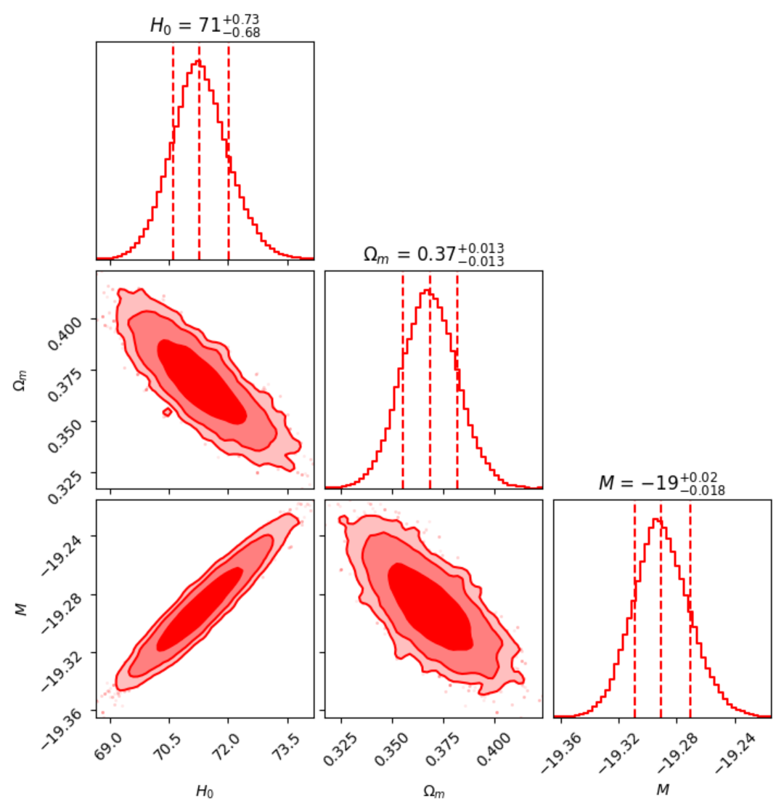

# ΛCDM Parameter Estimation

## Overview

This project constrains cosmological parameters of the ΛCDM model using late-time cosmological probes.

## Research Background

This work was completed during the DSKC Summer Internship Programme 2025.

The objective was to constrain ΛCDM cosmological parameters using observational datasets and Bayesian parameter estimation techniques.

## Datasets

- Type Ia Supernovae (SNe Ia)
- Baryon Acoustic Oscillations (BAO)
- Cosmic Chronometers (CC)
- Quasars (QSO)

## Methodology

- Chi-square minimization
- Bayesian Inference
- MCMC Sampling using emcee

## Parameters Estimated

- H₀
- Ωₘ
- M

## Tools Used

- Python
- NumPy
- Matplotlib
- emcee
- Google Colab

## Results

### Corner Plot

Posterior distributions and parameter correlations obtained from MCMC sampling.



## Repository Structure

```text
lcdm-parameter-estimation
│
├── lcdm_analysis.ipynb
├── corner_plots.png
├── DSKC_SIP2025_Poster.pptx
└── README.md
